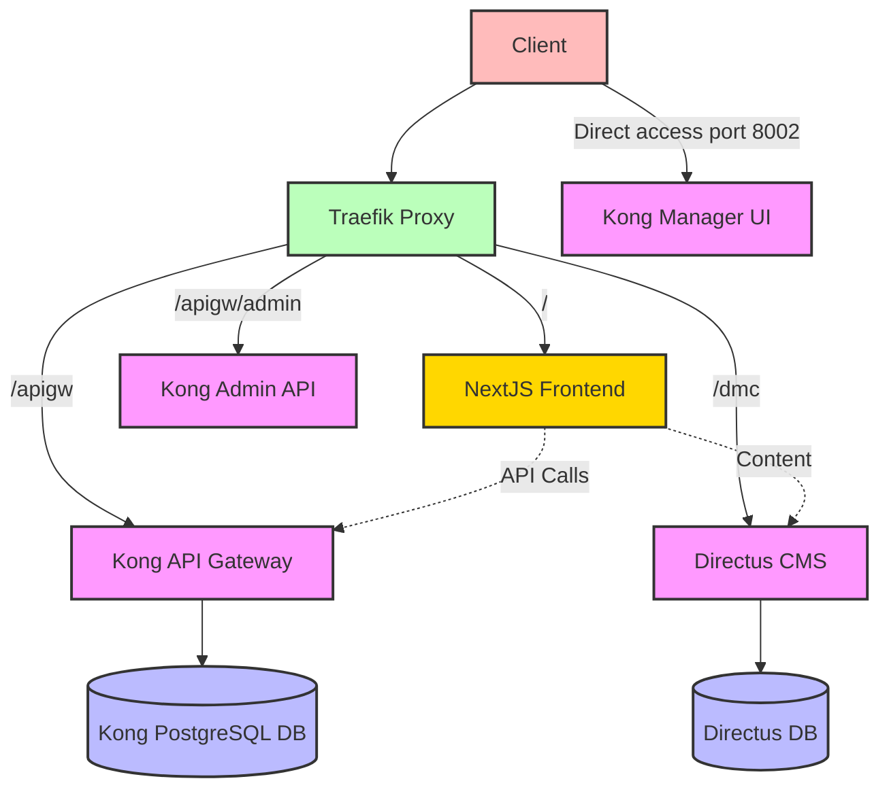

# POC Proxy DMC

Proof of concept for using Traefik as a reverse proxy for NextJS, Directus CMS, and Kong API Gateway.

## Architecture Diagram



### Architecture Explanation

#### Components

1. **Traefik Proxy**

   - Acts as the main entry point for all requests
   - Routes requests based on path prefixes
   - Applies middleware for path stripping

2. **Directus CMS**

   - Accessible via `/dmc` and `/dmc/admin` paths
   - Protected from direct access

3. **Kong API Gateway**

   - Proxy accessible via `/apigw`
   - Admin API accessible via `/apigw/admin`
   - Manager UI accessible directly via `http://localhost:8002`

4. **Databases**
   - Directus has its own database
   - Kong uses PostgreSQL for configuration storage

#### Request Flow

1. Client sends request to Traefik
2. Traefik routes the request based on path prefix
3. Appropriate middleware strips the prefix
4. Request is forwarded to the target service
5. Service processes the request and returns a response

#### Special Case: Kong Manager UI

Due to limitations in how Kong Manager handles base paths, it's accessed directly at port 8002 rather than through the Traefik proxy.

## Project Structure

```bash
poc-proxy-dmc/
├── directus/
│   └── docker-compose.yml
├── frontend/
│   ├── src/
│   ├── public/
│   ├── Dockerfile
│   └── docker-compose.yml
├── kong/
│   └── docker-compose.yml
├── traefik/
│   ├── config/
│   │   ├── directus.yml
│   │   ├── frontend.yml
│   │   └── kong.yml
│   ├── docker-compose.yml
│   └── traefik.yml
├── docker-compose.yml
├── setup_traefik.sh
├── cleanup_traefik.sh
├── setup_kong.sh
├── cleanup_kong.sh
├── instruction.md
└── README.md
```

## Setup Instructions

1. **Clone the Repository**:

   - Clone this repository to your local machine

2. Make the setup script executable:

```bash
chmod +x setup_traefik.sh
```

3. Run the setup script:

```bash
# Start all services: Traefik, Directus, Kong, and Frontend
./setup_traefik.sh
```

This script will:

- Create the necessary Docker network (traefik_network)
- Start Traefik as the reverse proxy
- Start Directus CMS with proper routing
- Start Kong API Gateway with proper routing
- Start the Next.js frontend application

### Cleanup

1. Make the cleanup script executable:

```bash
chmod +x cleanup_traefik.sh
```

2. Run the cleanup script:

```bash
# Stop all services and clean up resources
./cleanup_traefik.sh
```

This script will:

- Stop all services (Traefik, Directus, Kong, and Frontend)
- Remove the Docker containers
- Optionally remove the Docker network
- Optionally remove all data volumes

## Access Points

### Traefik

- Dashboard: `http://localhost:8080`

### NextJS Frontend

- Frontend: `http://localhost/`
- Architecture Diagram: `http://localhost/architecture`

### Directus

- Directus via Traefik: `http://localhost/dmc`
- Directus Admin via Traefik: `http://localhost/dmc/admin`

**Important**: Direct access to Directus is blocked for security reasons. All access must go through the `/dmc` path.

### Kong API Gateway

- Kong API Gateway via Traefik: `http://localhost/apigw`
- Kong Admin API (direct): `http://localhost:8001`
- Kong Manager UI (direct): `http://localhost:8002`

**Note**: The Kong Manager UI is accessed directly rather than through Traefik due to limitations in how it handles base paths.

## Detailed Documentation

For detailed implementation steps and advanced configuration options, see [instruction.md](instruction.md).

## Testing the Setup

To test if all services are properly configured and accessible, you can run the following commands:

### Test Directus

```bash
curl -I http://localhost/dmc/server/info
```

This should return a 200 OK response from the Directus API.

### Test Kong API Gateway

```bash
curl -I http://localhost/apigw
```

This should return a 200 OK response from Kong.

### Test Frontend

```bash
curl -I http://localhost/
```

This should return a 200 OK response from the Next.js frontend.

## Troubleshooting

### Bad Gateway Errors

If you encounter 'Bad Gateway' errors when accessing services through Traefik:

1. Check if all services are running:

   ```bash
   docker ps
   ```

2. Verify network connectivity:

   ```bash
   docker network inspect traefik_network
   ```

3. Check Traefik logs for routing issues:

   ```bash
   docker logs traefik-traefik-1
   ```

4. Ensure services are using the correct network in their docker-compose files

### Blank Pages in Directus Admin

If the Directus admin interface shows a blank page:

1. Ensure the PUBLIC_URL environment variable is set correctly in the Directus docker-compose.yml
2. Check browser console for JavaScript errors
3. Verify that the middleware for stripping prefixes is configured correctly

## Notes

- Default Directus admin credentials: admin@example.com / password123
- For production use, replace the placeholder keys and passwords with secure values
- Traefik dashboard is available at `http://localhost:8080` for monitoring routes and services
- Any attempt to access Directus directly (without the `/dmc` path) will be blocked with a 403 Forbidden error
- Kong API Gateway is configured to use PostgreSQL for its database
