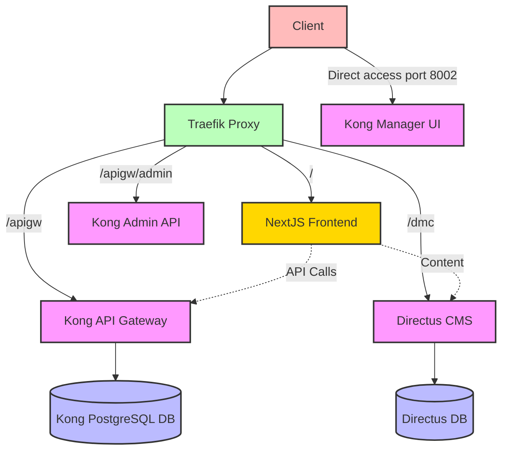

# Project Architecture Diagram

## Architecture Explanation

### Components

1. **Traefik Proxy**

   - Acts as the main entry point for all requests
   - Routes requests based on path prefixes
   - Applies middleware for path stripping

2. **Directus CMS**

   - Accessible via `/dmc` and `/dmc/admin` paths
   - Protected from direct access

3. **Kong API Gateway**

   - Proxy accessible via `/apigw`
   - Admin API accessible via `/apigw/admin`
   - Manager UI accessible directly via `http://localhost:8002`

4. **Databases**
   - Directus has its own database
   - Kong uses PostgreSQL for configuration storage

### Request Flow

1. Client sends request to Traefik
2. Traefik routes the request based on path prefix
3. Appropriate middleware strips the prefix
4. Request is forwarded to the target service
5. Service processes the request and returns a response

### Special Case: Kong Manager UI

Due to limitations in how Kong Manager handles base paths, it's accessed directly at port 8002 rather than through the Traefik proxy.
